# Machine Learning Engineer Nanodegree
## Capstone Project
Nicolás Kittsteiner
December 29, 2018

## I. Definition

### Project Overview

In the world of finance, particular on investment and stock trading, the disruption of cryptocurrencies1 or crypto assets2 related to the blockchain3 technology, created a new ecosystem of possibilities for investors. Based on the quantity of public information related to cryptocurrencies available on the Web it’s possible to perform different analysis related of valuation and future price predictions using the appropriate key data and supervised machine learning algorithms.

Ethereum4 is a cryptocurrency that handles a technology called Ethereum Virtual Machine (EVM)5. This allows to process smart-contracts6 which is custom code statements that enable multiple use cases like, creating autonomous organizations, making crowdfunding projects, or applications that can transfer value automatically if the rules defined in the contract are processed accordingly. In this way it’s possible to understand this invention as a commodity like for instance a cloud-based provided for computing.

The idea of this project is to investigate if it's possible to predict Ethereum prices based on different machine learning algorithms and a sample dataset containing daily information about trades and network health. 

Machine learning seems to be a good fit to this problems considering the quantity of features in the datasets that needs to be correlated and analysed in order of obtaining a prediction. A manual processing of all this data would be a slow and tedious process.

There are several studies related to predicting fluctiations on cryptocurrencies prices7 8 9 with different approaches and focus on specific cryptoassets like Bitcoin In general there is an application of patterns and techniques used in the stocks prediction on finance, and moving this knowledge to the cryptocurrency world.

### Problem Statement

In this exploration, based on network and pricing information of Ethereum (ETH), the goal is to predict with some degree of confidence the 'close' price of this cryptocurrency. For that, the steps involved in the analysis and implementation includes:

- Analizing ethereum dataset prices and network 
- Data cleaning / merge. 
- Determine most important features in the dataset. 
- Separate training and testing datasets. 
- Determine an evaluation metric.
- Explore different supervised machine learning approaches to the problem.
- Test each model results using the evaluation metric defined.
- Giving a benchmark analysis.

With all this steps, it's possible to expect identify one or more approaches that may solve the problem of prices prediction, and determine if the performance of this models could be used on a real world application.

### Metrics

In the case of a regression problem the selected metric is R2: 

R2 = 1 - (SSres / SStot)

Where:

- SSres : corresponds to the residual sum of squares.
- SStot : is the total sum of squares.

Which provides a measure of how well future samples are likely tho be predicted for each model. The best scores are close to 1.0 and also can be negative if the model performs worse. In the case that the R2 score is 0.0, this tells that the model doesn't take in account input features and always returns the same results.

R2 it's more interesting in this context because using mean squared error doesn't give enough information if the model performs bad or worst than another.

## II. Analysis

### Data Exploration

The dataset used is a composition of different sources that has historical information of different cryptocurrencies, but in this analysis only two sets are considered (ethereum_price and ethereum_dataset) 10. The fields considered on each dataset are:

- Ethereum Dataset (ethereum_dataset.csv):
    - Date(UTC) : Date of transaction
    - UnixTimeStamp : unix timestamp
    - eth_etherprice : price of ethereum
    - eth_tx : number of transactions per day
    - eth_address : Cumulative address growth
    - eth_supply : Number of ethers in supply
    - eth_marketcap : Market cap in USD
    - eth_hashrate : hash rate in GH/s
    - eth_difficulty : Difficulty level in TH
    - eth_blocks : number of blocks per day
    - eth_uncles : number of uncles per day
    - eth_blocksize : average block size in bytes
    - eth_blocktime : average block time in seconds
    - eth_gasprice : Average gas price in Wei
    - eth_gaslimit : Gas limit per day
    - eth_gasused : total gas used per day
    - eth_ethersupply : new ether supply per day
    - eth_chaindatasize : chain data size in bytes
    - eth_ens_register : Ethereal Name Service (ENS) registrations per day

- Ethereum prices (ethereum_price.csv):
    - Date : date of observation
    - Open : Opening price on the given day
    - High : Highest price on the given day
    - Low : Lowest price on the given day
    - Close : Closing price on the given day (*)
    - Volume : Volume of transactions on the given day
    - Market Cap : Market capitalization in USD

Most of the information of each dataset contains dates and decimal features that go from negative values to thousands. To merge both datasets, each dataset has to be formatted using dates as key, also the last row in prices hasn't information about prices so needs to be excluded. There are also some 'Close' days that are missing from the dataset 'Prices'. Looking to each dataset statistics, appears to be consistent without many outliers on each feature.

### Exploratory Visualization

The first task that needs to be done in order to identify the more relevant features is to visualize the correlation between each feature of the merged dataset.

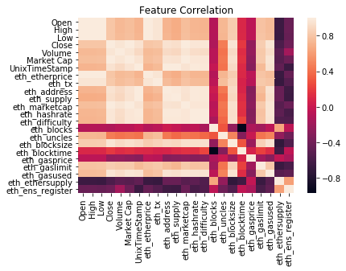

In this graph it's possible to identify (in lighter colors) the correlation index. Using non correlated features doesn't really help when splitting data for each model. The high correlated features in comparison with the 'Close' are: 

Field | Correlation index
--- | --- |
eth_marketcap | 0.999769
Market Cap | 0.996268
eth_tx | 0.966170
eth_address | 0.958083
eth_gasused | 0.951524
eth_hashrate | 0.939107
eth_blocksize | 0.930363
Volume | 0.907974
eth_difficulty | 0.827023

### Algorithms and Techniques

In this exploration the idea behind forecasting a variable it's part of a regression problem. It's possible to use several algorithms and techniques. Nevertheless, in the context of this investigation, the set of algorithms to use focused on resolving the problem of predicting the ETH price are:

- Linear Regression: The most common and simple method when it's used to forecast a variable based on a different set of features. Linear regression basically creates a line, or an hyperplane in the case of multiple features in such way that can match roughly the features with a predicted price using previous training points. The set of input parameters used are <i>de facto</i> parameters. 
- K-Nearest Neighbors Reggressor: Often used for clustering problems, also have application on time series analysis and financial predictors. The idea behind K-NN is to get the closests training examples based on the distance to the new point. The numbers of samples can be set constant, in this case the number of neighbors is two.
- Random Forest Regressor: The random forest algorithm it's part of the ensemble methods that create estimators or week learners based on sub-models, combining this predictions in order to improve robustness. In the case of Random Forest algorithm each tree in the ensemble it's created and picked based on a random subsets of the features. The idea of using this technique to this problem is to look how well this randomness in picking features could improve on the regression prediction. The set of parameters also are default parameters in this case.
- Ada Boost Regressor: It's another ensemble method which based on a sequence of week learners, make each learner check the errors of the past learner. Each learner will be punished if the points are misclassified based on a loss function, then the model combines all this weigthen models, discarding the models that has high loss on accuracy. The idea to use this supervised method is similar that in Random Forest Regressor, evaluates how well the model based on the specific parameters can beat the Linear Regression. In the case of this algorithm, the configuration parameters are different to the default values. Specifically the base estimator is set to a decision tree regressor with max depth of 10.
- Gradient Boosting Regressor: It's another ensemble methods that has a Boosting technique similar to AdaBoost but has a differentiable loss functions. The idea of using this algorithm is similar at picking Random Forest and Ada Boost. It has another parameter configuration described next:
    - Number of estimators: 1000
    - Max depth: 4
    - Minimun sample split: 2
    - Learning rate: 0.01
    - Loss: ls

In all this algorithms the way of work is the same, that is, pass training set of X and y to fit the algorithm and then make a prediction using a test set of X features.

### Benchmark

To compare each of this techniques, the R2 score it's computed based on a previous trained model, on the test set of features, and with this prediction, compare with the y values of the test case. So the results on each algorithm are:

Model | R2 Score
--- | --- |
Linear Regression | 0.7654767848001398
K-Nearest Neighbors Reggressor | -1.9013806360331635
Random Forest Regressor: | -1.169761995372531
Ada Boost Regressor | -1.112811356682978
Gradient Boosting Regressor | -1.3588933042301603

The R2 score makes sense as a benchmark indicator of how good the model is making predictions because for instance if the model gives an score of 0.66 then there is a 34% percent of variability that still unaccounted for. If the score is negative then the model perform worst than in a simple average model. Also in this problem time and efficiency in the prediction isn't critical to take in consideration how fast the models performs. 

## III. Methodology

### Data Preprocessing

In the data exploration, given the nature of the data analyzed there, there was four steps in order to normalize data formats and some data of the close date that wasn't present. 

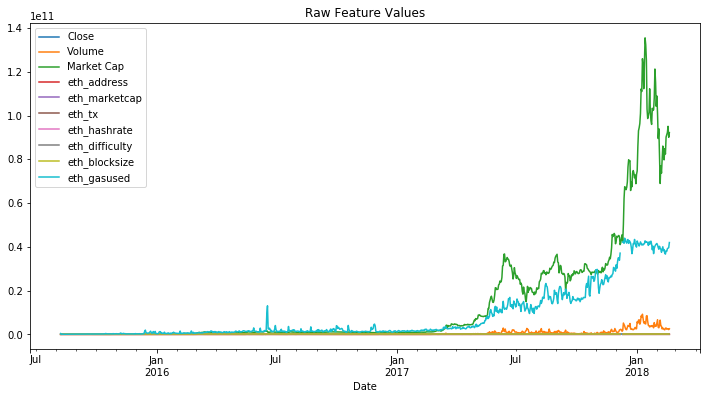

- The two datasets needs to be merged by the key, in this case the date of the record, before analyzing. There was a date transformation to match the format of the 'price' dataset. The last record in the price dataset was discarded because hasn't information about the close price.

- The first step is to apply a logarithmic transformation to all numerical variables.

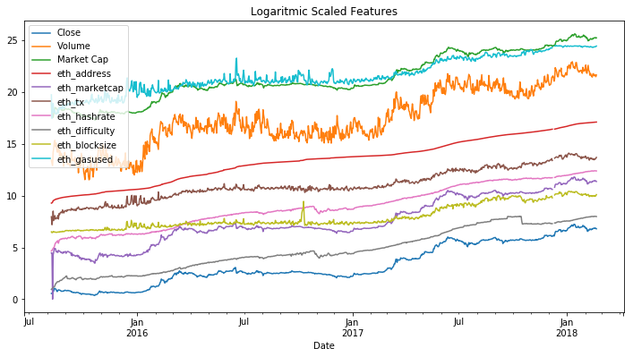

- Then using a scaler (Min-Max) all this numerical features was translated to values between 0 and 1.

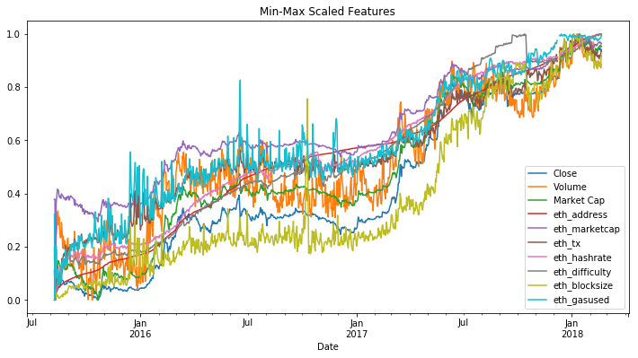

- Finally filling null values using a backfill method.

Before:

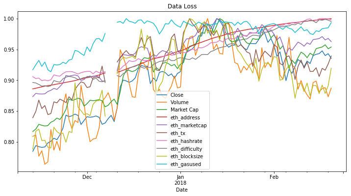

After:

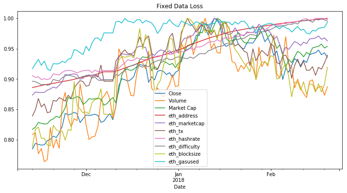

### Implementation

A prerequisite for each model consider splitting data for training and testing. The data was separated by 70/30 for training and testing sets, but because it's a time serie, it's not recommended for the training set to be <i>peeking the future</i>, because this can produce unrealistic optimistic predictions.

For each algorithm selected, the process of implementing a model consider this tasks:

- On Linear Regression algorithm: 
  - Create an instance of Linear Regression using Scikit-learn library.
  - Fit the model using X features and y variable of the training set.
  - Make a prediction using X features of the test set
  - Get R2 score results predicted with the actual y^ values of the test set.
  - Make a visualization of the predicted values vs actual y^ values.
  
- In the case of the K-Nearest Neighbors Reggressor the steps for implementing this model was the same as Linear Regression algorithm:
  - Create an instance of KNN Regression using Scikit-learn library, setting the number of neighbors to two (n_neighbors=2)
  - Fit the model using X features and y variable of the training set.
  - Make a prediction using X features of the test set
  - Get R2 score results predicted with the actual y^ values of the test set.
  - Make a visualization of the predicted values vs actual y^ values.
  - The results wasn't very intuitive compared with Linear Regression, so a manual check on parameters was performed in order to try to improve the quality of the prediction, but the algorithm doesn't improve the results as expected with the first algorithm selected.
- In the Random Forest Regressor the steps are roughly the same as with the other two algorithms:
  - Create an instance of Random Forest Regressor using Scikit-learn library, passing no extra parameters to the instance.
  - Fit the model using X features and y variable of the training set.
  - Make a prediction using X features of the test set
  - Get R2 score results predicted with the actual y^ values of the test set.
  - Make a visualization of the predicted values vs actual y^ values.
- Again with Ada Boost Regressor the steps implemented was:
  - Create an instance of Ada Boost Regressor using Scikit-learn library, passing as configuration parameter a `base_estimator=DecisionTreeRegressor(max_depth=10)`.
  - Fit the model using X features and y variable of the training set.
  - Make a prediction using X features of the test set
  - Get R2 score results predicted with the actual y^ values of the test set.
  - Make a visualization of the predicted values vs actual y^ values.
- Finally, in the Gradient Boosting Regressor the steps for implementing the model was:
  - Create an instance of Gradient Boosting Regressor using Scikit-learn library, passing as configuration parameter a `'n_estimators': 500, 'max_depth': 4, 'min_samples_split': 2,
          'learning_rate': 0.01, 'loss': 'ls'`.
  - Fit the model using X features and y variable of the training set.
  - Make a prediction using X features of the test set
  - Get R2 score results predicted with the actual y^ values of the test set.
  - Make a visualization of the predicted values vs actual y^ values.

On of the challenges was trying to understand why the KNN, AdaBoost, GBR and Random Forest, the results was so low on the R2 Score. Using different configuration doesn't improve the models predictions. This is discussed in the next section.

### Refinement

In general the algorithms doesn't perform the way it was expected, with the exception of Linear Regression that performs reasonable well. 

The approach was first try to get a better  R2 score in the KNN Regressor algorithm:

- Applying PCA for dimensionality reduction. The results obtained doesn't get better results on the score
- Using grid search cross validation for obtaining best parameters performance:
  -  `n_neighbors` from 1 to 20
  -  `leaf_size` from 1 to 100
  -  `weights`: `uniform` or `distance`
  -  `algorithm`: `auto`, `ball_tree`, `kd_tree`, `brute`.
  -  The optimal parameters setting was:
     -  `n_neighbors`: 4
     -  `leaf_size` 1
     -  `weights`: `distance`
     -  `algorithm`: `brute`

    The results obtained in the score doesn't improve results significantly (from -1.90 to -1.87)

In the case of Linear Regression, the refinement was using the PCA training set and compare the R2 score which improve from `0.76` to `0.83` 

The last refinement step was using a time series split of the training and testing data. The results are explained in the next section.

## IV. Results

### Model Evaluation and Validation

In the case of this evaluation and considering the unexpected poor results from the models,the only algorithm that could fit the problem is the Linear Regression. Again trying to adapt training and test sets using timeseries split gives some information about how models behave gives some clues about the overfitting problem in most cases.

For instance this are the results obtained running Linear Regression and K-Nearest Neighbors algoritms and different sizes of training and testing data. Also taking in consideration that the time series split technique use takes random splits of training and testing data but that are always one before the latest.

Training Set | Testing Set | R2 Linear Regression Score | R2 K-Nearest Neighbors Score
--- | --- | --- | --- |
 157 | 153 | -0.713 | -6.692
 311 | 153 | -2.6 | -3.312
 465 | 153 | 0.920 | -0.029
 619 | 153 | 0.767 | -6.491
 773 | 153 | 0.568 | -0.986

 This means that changes on the data generate big differences in the prediction considering the scores. So a big training set doesn't mean that the result of the predictors improve. And results couldn't be trusted taking this in consideration.

### Justification

On this exploration none of the results obtained has a considerable improvement from the begining of the exploration and benchmarks, so it's possible to conclude that the problem trying to resolve, that's the ETH price prediction isn't factible with the current strategy.

## V. Conclusion

### Free-Form Visualization

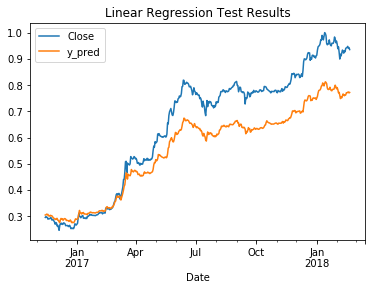
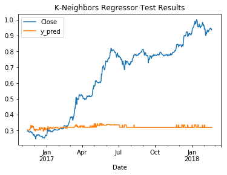
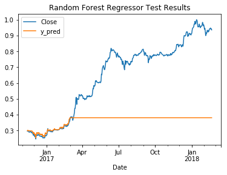
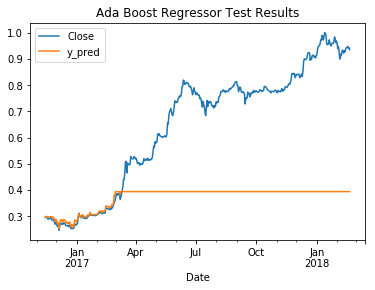
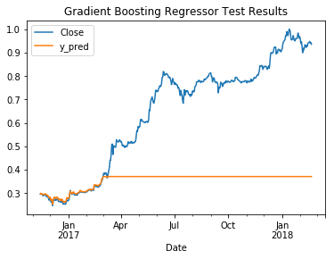
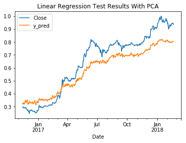
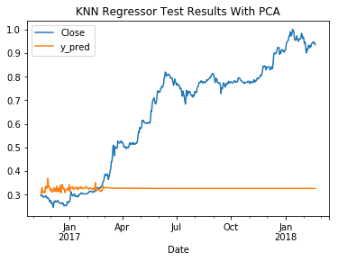
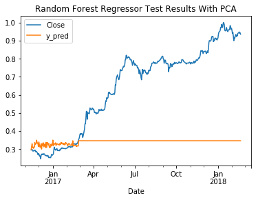

### Reflection

In this exploration, the idea behind predicting the Ethereum price based on a daily dataset involves several steps as described in the problem statement section above.

One of the difficults found in this analysis was the time series nature of the datasets and how splitting the data in training and testing sets affects how models performs. Also the selected algorithms aside Linear Regression, doesn't seems to be quite appropiate for the given problem.

There isn't enough evidence to consider this exploration to suit a real world application for Ethereum price prediction. Nevertheless using Linear Regression could be used to analyse trends for buying and selling, and getting a rough estimator for portfolio management for Ethereum. In the case of using this approach for other cryptoassets it's needed to analyse and detect which features correlates with the close price before training and testing a model for this cryptocurrencies.

### Improvement

Another exploration could include the use of Deep Learning or Reinforcement Learning and analyse the performance on prediction using such techniques. But in general predicting prices of stocks markets is a difficult task because there are many other variables that aren't so easy to management and capture. But including social media analysis and correlation with other assets like <i>fiat</i> currencies, price of metals and statistics of different markets could be another exploration to higher quality on prediction.

### References

1. Burniske, Tatar: “Cryptoassets: The Innovative Investor’s Guide to Bitcoin and Beyond” ISBN: 978-1-26-002668-9
2. Ídem nº1
3. Nakamoto: “Bitcoin: A Peer-to-Peer Electronic Cash System”, https://bitcoin.org/bitcoin.pdf
4. Ethereum, “Ethereum White Paper”, https://github.com/ethereum/wiki/wiki/White-Paper
5. Ídem nº4
6. Ídem nº4 
7. Bin Kim, Gi Kim, Wook Kim, Ho Im, Hyeong Kim, Jin Kang, Hun Kim: "Predicting Fluctuations in Cryptocurrency Transactions Based on User Comments and Replies" https://journals.plos.org/plosone/article?id=10.1371/journal.pone.0161197
8. McNally: "Predicting the price of Bitcoin using Machine Learning", http://trap.ncirl.ie/2496/1/seanmcnally.pdf
9. Madan, Saluja, Zhao: "Automated Bitcoin Trading via Machine Learning Algorithms", https://pdfs.semanticscholar.org/e065/3631b4a476abf5276a264f6bbff40b132061.pdf
10. https://www.kaggle.com/sudalairajkumar/cryptocurrencypricehistory/home
